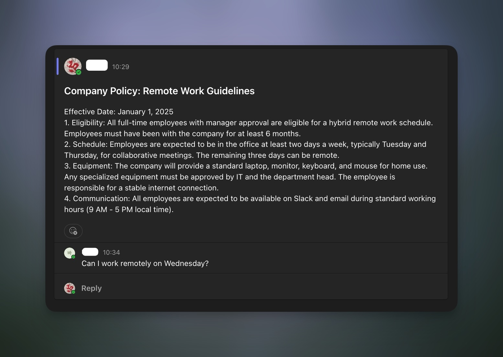

# Microsoft Teams RAG

A RAG system that ingests data from Microsoft Teams (files and message threads) into a Qdrant vector database and provides a question-answering interface via a Telegram bot.

## Features

-   **Data Ingestion**: Periodically scans MS Teams channels for new or updated files and message threads.
-   **Automatic Vector Database Sync**: Keeps the Qdrant vector database up-to-date by detecting and reflecting changes in Teams:
    -   Updates or message threads and replies if they are edited or deleted in Teams.
    -   Updates files if they are changed in OneDrive or removed from a channel.

### Demo

<div style="display: flex; gap: 10px;">
  
  
</div>
<div style="display: flex; gap: 10px; margin-top: 10px;">
  
  
</div>

## Setup and Installation

### Prerequisites

-   `gcloud` CLI installed and configured with a billing-enabled Google Cloud project.
-   An active Microsoft 365 subscription to create an Azure App.
-   Docker for easy deployment

### Getting Credentials

#### 1. Microsoft Azure

To interact with the Microsoft Graph API, you need to register an application in Microsoft Azure. The `MS_TENANT_ID`, `MS_CLIENT_ID`, and `MS_CLIENT_SECRET` variables can be obtained this way.

1.  Go to the [Azure portal](https://portal.azure.com/) and navigate to **Microsoft Entra ID**.
2.  Go to **App registrations** and click **New registration**.
3.  Give your application a name (e.g., "Teams Ingestion Bot").
4.  For **Supported account types**, select "Accounts in this organizational directory only".
5.  Click **Register**.
6.  From the app's overview page, copy the **Application (client) ID** and **Directory (tenant) ID**. These are your `MS_CLIENT_ID` and `MS_TENANT_ID`.
7.  Go to **Certificates & secrets**, click **New client secret**, give it a description, and copy the **Value**. This is your `MS_CLIENT_SECRET`.
8.  Go to **API permissions**, click **Add a permission**, select **Microsoft Graph**, and then **Application permissions**.
9.  Add the following permissions:
    -   `ChannelMessage.Read.All`
    -   `Files.Read.All`
    -   `Team.ReadBasic.All`
    -   `Channel.ReadBasic.All`
10. Click **Grant admin consent for [Your Directory]**.

#### 2. Google Cloud (for Vertex AI)

The application uses Vertex AI for embeddings. To allow the Docker container to authenticate with Google Cloud, you need to configure credentials. First, ensure `gcloud` is set up on your machine with a billing-enabled project.

1.  **Set your project:**
    ```bash
    gcloud config set project YOUR_PROJECT_ID
    ```

2.  **Create a service account:**
    ```bash
    gcloud iam service-accounts create vertex-docker-runner --display-name="Service Account for Vertex AI Docker App"
    ```

3.  **Grant the service account the "Vertex AI User" role:**
    ```bash
    gcloud projects add-iam-policy-binding YOUR_PROJECT_ID \
    --member="serviceAccount:vertex-docker-runner@YOUR_PROJECT_ID.iam.gserviceaccount.com" \
    --role="roles/aiplatform.user"
    ```

4.  **Create and download a key for the service account:**
    ```bash
    gcloud iam service-accounts keys create gcloud_credentials.json \
    --iam-account="vertex-docker-runner@YOUR_PROJECT_ID.iam.gserviceaccount.com"
    ```
    This creates a `gcloud_credentials.json` file. For the application to use it from Docker, you would typically mount this file and set the `GOOGLE_APPLICATION_CREDENTIALS` environment variable. However, the current setup assumes the host environment is already authenticated (e.g., via `gcloud auth application-default login`).

### Docling GPU/CPU parsing 

The `ingest` service is configured by default to use a GPU for loading and parsing documents with `docling`, which speeds up the ingestion of data.

-   **For GPU users**: Ensure you have an NVIDIA GPU, the necessary drivers, and the NVIDIA Container Toolkit installed on your host machine. The provided `docker-compose.yml` and `Dockerfiles/ingest.Dockerfile` are already set up for GPU usage.

-   **For CPU-only users**: If you do not have a GPU, you must modify the configuration to run on the CPU.
    1.  In `docker-compose.yml`, remove or comment out the `deploy` section for the `ingest` service.
    2.  In `Dockerfiles/ingest.Dockerfile`, change the base image from the PyTorch CUDA image to a standard Python image.

### Running the Project

1.  Clone the repository.
2.  Create a `.env` file in the root directory and fill in the values for all the environment variables described below or see `.env.example` file.
3.  Build and run the containers:
    ```bash
    docker-compose up --build -d
    ```

This will start three services:
-   `qdrant-db`: The vector database.
-   `ingest`: The data ingestion service.
-   `bot`: The Telegram bot service.

### Notes on Ingestion Scheduling

-   By default, the ingestion service checks for new or updated data every 300 seconds (5 minutes), as specified by the `sleep 300` command in the `ingest.Dockerfile`.
-   For more robust or flexible scheduling (e.g., running ingestion at specific times), you can implement a cron job either inside the container or on the host system to trigger the ingestion process.

## Environment Variables Explained

All configuration is managed through the `.env` file.

### Google Environment Variables
-   `GOOGLE_API_KEY`: Your Google API Key can be obtained from Google AI Studio.
-   `GOOGLE_CLOUD_PROJECT`: Your Google Cloud Project ID.
-   `GOOGLE_CLOUD_LOCATION`: The Google Cloud region for Vertex AI services (e.g., `us-central1`).

### Gemini Embedding Model Variables
-   `EMBEDDING_MODEL_NAME`: The name of the embedding model to use. The default is `gemini-embedding-001`.
-   `EMBEDDING_DIMENSION`: The output dimension of the embeddings. This must match the model's capabilities (e.g., `3072` for `gemini-embedding-001`).
-   `EMBEDDING_BATCH_SIZE`: The number of documents to embed in a single API call.
    > **Note:** The `gemini-embedding-001` model, when accessed via Vertex AI, currently only supports a one instance per request (EMBEDDING_BATCH_SIZE=1). If you switch to a different Google embedding model that supports larger instances per request, you can increase this value and update the `EMBEDDING_MODEL_NAME` and `EMBEDDING_DIMENSION` accordingly for quicker ingestion. For other Google embedding models, see [here](https://cloud.google.com/vertex-ai/generative-ai/docs/embeddings/get-text-embeddings).

### Qdrant Variables
-   `QDRANT_URL`: The URL of the Qdrant instance.
-   `COLLECTION_NAME`: The name of the collection within Qdrant to store the vectors.
-   `RETRIEVER_K`: The number of documents to retrieve from the vector store for each query.
-   `MAX_TRANSFORM_ATTEMPTS`: The maximum number of times the RAG agent will try to rewrite a user's query if no documents are found.

### MS Teams Variables
-   `DEFAULT_START_TIME_STR`: The initial timestamp (ISO 8601 format) from which to start ingesting data if no previous run state is found.
-   `MS_TENANT_ID`: Your Azure Directory (tenant) ID.
-   `MS_CLIENT_ID`: Your Azure Application (client) ID.
-   `MS_CLIENT_SECRET`: Your Azure client secret value.
-   `MS_TEAM_NAME`: The exact display name of the Microsoft Team to ingest data from.
-   `MS_CHANNEL_WHITELIST`: (Optional) A comma-separated list of channel names to ingest from. If commented out or empty, all channels in the team will be processed.
-   `SUPPORTED_FILE_EXTENSIONS`: A comma-separated list of file extensions to process during file ingestion.

### Telegram Variables
-   `TELEGRAM_BOT_TOKEN`: Your token for the Telegram bot, obtained from BotFather.
-   `MAX_HISTORY_MESSAGES`: The number of user/assistant message pairs to retain in the conversation history for context.

---

> **Note:** If you are planning to use this system within your own company and require enhanced data privacy, it is recommended to use an Azure Bot integrated within Microsoft Teams instead of Telegram.
